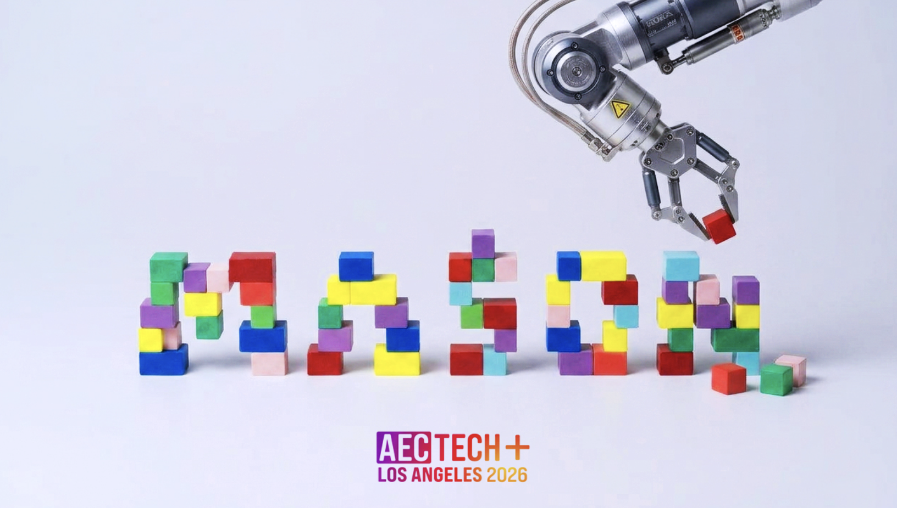
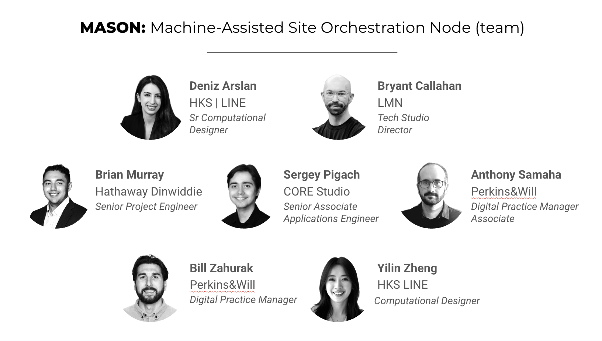

# Mason




Tabletop site-making: a robot arm lays out physical blocks, computer vision reads their footprints, and generative AI projects a photorealistic landscaped site back down onto the table.

---

## What is Mason?

Mason is a hack from the AECtech hackathon exploring how to **design with your hands** – arranging real blocks on a table instead of dragging massing volumes around in a CAD window.

A six-axis robot arm picks and places blocks on a white grid, its wrist camera watches the layout, a depth model reads each block, and a generative model turns the scene into a photorealistic site: every block becomes a building on its exact footprint, and everything else becomes landscaping – grass, trees, parks, and paths. That render is projection-mapped straight back onto the physical blocks, so the bare grid in front of you lights up as a tiny site you can rearrange by hand.

Think of it as a mason that lays your blocks and instantly imagines the finished site: _move a block, and a building appears on it._

---

## Motivation

Early-stage massing and site design is still mostly foam models, cardboard, and screenshots of CAD. Robotic and digital pipelines exist, but they're:

- Locked behind a screen and a mouse  
- Slow to translate a rough physical idea into something photoreal  
- Hard for non-designers in the room to read and play with  

Mason asks: **what's the minimum amount of hardware and computation needed to turn a hands-on massing model into an instant, photorealistic site – without anyone touching a keyboard?**

### Our goals

- Keep the design **tactile and physical** (blocks on a table, not volumes on a screen)  
- Provide **instant, legible feedback** (a projection onto the model, not another monitor)  
- Build a path from **physical massing model → rendered site vision** in one loop  

---

## How it works (concept)


### 1. The robot lays out the blocks

The target layout comes from Rhino/Grasshopper. `grasshopper/plane_to_robot_pose.py` converts each Rhino `Plane` into a robot pose – position plus an orientation quaternion – handling the Rhino↔robot frame change (the URDF defines `world→base_link` as `Rz(-π/2)`) and the tool-faceplate axis remap. Grasshopper drives the [Standard Bots RO1](https://standardbots.com/) live, and the `OnRobot_Gripper_YZ.gh` / `Projector_YZ.gh` definitions place the gripper and calibrate the projector geometry.

### 2. Camera capture

The RO1's wrist camera grabs a single JPEG of the table (`/api/v1/camera/frame/rgb`). Every frame goes through one PIL pass that **rotates 180°** (the camera is mounted upside-down), **darkens** the over-exposed image with a gain + gamma LUT, and **masks everything outside the grid quad** (`GRID_QUAD`) to black – so only the table makes it downstream, consistently, across every script.

### 3. Local depth estimation

[Depth Anything V2](https://huggingface.co/depth-anything) runs on-device (Apple MPS / CPU) to produce a grayscale depth map – brighter = higher. Percentile windowing and a local-contrast pass make sure blocks of similar height still separate cleanly, so the generator can tell one footprint from another.

### 4. Generative render

The photo + depth map go to **Azure FLUX.2-flex** or **gpt-image-2** with a strict projection-mapping prompt: keep the viewpoint pixel-for-pixel, turn each white block into a building on its exact footprint (its raised top becomes the roof), and render everything else as landscaping – grass, trees, parks, paths. No LLM is in the creative loop – the design intent lives in one human-editable `PROMPT`.

### 5. Projection back onto the table

A native Cocoa `NSWindow` displays the result fullscreen on the projector – aspect-preserved, grid-masked, above the menu bar – registered on top of the real blocks. Move a block and press `f`: `project_flux.py` re-captures and re-renders. The bare grid becomes a living site.

---

## Architecture

The system runs as two coordinated pipelines – a robot/control architecture that lays out the physical blocks, and a vision/generation architecture that turns the scene into a projected site.


---

## Use cases we're exploring

- Rapid massing and site studies for campus / urban design, driven by physical blocks  
- Client and stakeholder workshops where anyone in the room can rearrange the site  
- Teaching tool for massing, density, and site planning  
- Interactive installations where the crowd builds and the system renders  


## Hardware

- Standard Bots RO1 six-axis robot arm
- OnRobot 2FG7 two-finger gripper
- Wrist-mounted RGB camera (on the RO1)
- HDMI projector aimed at the table
- Laptop (macOS) running Rhino + Grasshopper and the Python pipeline
- White grid surface + pickable blocks (2×2, 3×3, 4×4 units – STLs and Rhino sources in `blocks/`)

---

## Software

### Rhino + Grasshopper (`grasshopper/`, `blocks/`)

Grasshopper definitions and scripts for:

- Live control of the RO1 (`003-swiftlet-test-mcp.ghx`), a movable target (`002-...-movable-target.ghx`), and procedural recording (`004-...-procedural-recording.ghx`)
- `plane_to_robot_pose.py` – Rhino `Plane` → robot pose (x, y, z + quaternion), frame-correct between Rhino `world`/`base`
- Gripper and projector calibration (`OnRobot_Gripper_YZ.gh`, `Projector_YZ.gh`)
- Block geometry and the pick-and-place layout source (`blocks/Pick and Place - Block V1.gh`, `.3dm` files)

### Python pipeline (`SiteProjection/`)

A small, mostly stdlib pipeline to:

- `camera_feed.py` – pull frames from the wrist camera and keep `snapshot.jpg` fresh (every 100 ms)
- `depth_flux.py` – compute a local depth map (Depth Anything V2) and render via gpt-image-2 / FLUX / local ControlNet
- `project_flux.py` – capture → Azure FLUX.2-flex → fullscreen projector, with the interactive `f`-to-regenerate loop
- `show_image.py` – project any image fullscreen on the external monitor (no AI; handy for projector alignment)
- `diagnose.py` – claim API control of the arm and smoke-test the OnRobot 2FG7 gripper

### ROS 2 description packages

- `standard_bots_description/` – URDF/xacro, meshes, and RViz config for the RO1 arm
- `onrobot_2FG7_gripper_description/` – URDF and meshes for the 2FG7 gripper

---

## Third-Party Packages

The following packages are used in this solution:

### Capture + projector
- pyobjc-framework-Cocoa
- pillow
```python
# run in terminal
pip install pyobjc-framework-Cocoa pillow
```

### Local depth + generation
- transformers
- torch
- (optional) diffusers — for the local ControlNet generator
```python
# run in terminal
pip install transformers torch
```

### Robot control
- standardbots
```python
# run in terminal
pip install standardbots
```

---

## Running the demo (hackathon flow)

### 1. Set up the scene

- Mount the projector with a clear, registered view of the grid surface
- Create a `.env` in the repo root (or in `SiteProjection/`) with your robot + Azure credentials. **Keep this out of git** – the repo `.gitignore` ignores `.env`:
```
ROBOT_URL=https://<your-robot>.sb.app
ROBOT_TOKEN=<robot api token>
AZURE_FLUX_ENDPOINT=https://<res>.services.ai.azure.com/providers/blackforestlabs/v1/flux-2-flex?api-version=preview
AZURE_FLUX_KEY=<key>
AZURE_OPENAI_IMAGE_ENDPOINT=https://<res>.openai.azure.com
AZURE_OPENAI_IMAGE_KEY=<key>
```

### 2. Claim control of the arm

- The RO1 ignores API commands while the iPad / web Routine Editor holds control.
```
python3.11 SiteProjection/diagnose.py
```
- This checks the control mode, claims `api` control, and pulses the gripper open/closed to confirm the link end-to-end.

### 3. Calibrate the projector + grid

- Run `python3.11 SiteProjection/show_image.py <image>` to project a test image and align the projector to the table.
- Tune `GRID_QUAD` in `project_flux.py` (normalized TL, TR, BR, BL corners) so everything outside the grid is masked to black.

### 4. Load a layout

- Open the Grasshopper file (`grasshopper/003-swiftlet-test-mcp.ghx`)
- Reference the Rhino blocks / footprints the arm should lay out 1:1

### 5. Start the live wrist feed (optional)

```
python3.11 SiteProjection/camera_feed.py
```
- Keeps `snapshot.jpg` refreshed every 100 ms so the generators always read a fresh frame.

### 6. Capture → render → project

```
# Photo-only via FLUX.2-flex (supports the interactive 'f' re-generate loop):
python3.11 SiteProjection/project_flux.py

# Depth-conditioned via gpt-image-2 (renders once, then projects):
python3.11 SiteProjection/depth_flux.py
```
- Verify the projected render lines up with the physical blocks.

### 7. Build with guidance

- Rearrange the blocks by hand (or let the arm place them)
- In `project_flux.py`, press `f` to re-capture and re-generate; press `q` to quit
- Each block becomes a building, projected back onto the table in real time

---

## Roadmap / ideas

- Closed-loop placement: arm reads the depth map and auto-arranges blocks to a target layout
- Richer prompts and styles (day/night, materials, density, climate)
- Direct hookups to BIM (Revit, IFC, Speckle) for push-button massing sets
- Multi-user tables and larger grids
- Faster local generation to cut the capture→projection latency

---

## Team


